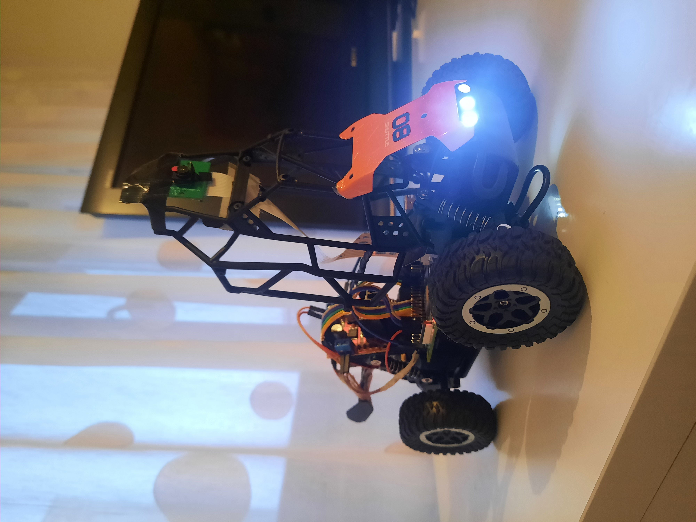

# MForge Robot Control System

## 🏭 About MForge

MForge is a robotics team from Zenica, Bosnia and Herzegovina, combining mechanical engineering expertise with innovative software solutions. Our name represents our roots - "MF" from Mechanical Faculty and "Forge" from our steel city Zenica, symbolizing our commitment to crafting robust and efficient robotic systems.

Our team consists of:
- **Amil**: Lead Future engineer
- **Bakir**: Mechanical Design Future engineer
- **Amar**: Control Systems FUture engineer

We are passionate about robotics and automation, focusing on developing intelligent systems that combine mechanical precision with advanced software control. Our work on the Raspberry Pi Robot Control System represents our commitment to creating practical, efficient, and innovative solutions in the field of autonomous robotics.



## 🚀 Introduction

The MForge Robot Control System is a sophisticated autonomous vehicle control system designed for precise navigation, obstacle avoidance, and path following. This system combines computer vision, real-time control algorithms, and mechanical engineering principles to create a robust and efficient autonomous vehicle.

## 🏗️ System Architecture

### Hardware Components
- **Raspberry Pi 4**: Main control unit
- **Camera Module**: Vision system input
- **Motor Controllers**: L298N dual H-bridge
- **Drive Motors**: DC motors for movement
- **Steering System**: Servo or DC motor-based steering
- **Power System**: Battery management and distribution

### Software Modules

1. **Main Control System** (`main.py`)
   - Core control loop
   - Decision making and state management
   - Hardware interface coordination

2. **Vision System** (`vision.py`, `camera_sim.py`)
   - Real-time image processing
   - Color-based object detection
   - Path and obstacle recognition

3. **Motion Control** (`robot.py`)
   - Motor control algorithms
   - Trajectory planning
   - Position and orientation tracking

4. **Environment Simulation** (`field.py`, `viewer.py`)
   - 3D environment representation
   - Physics simulation
   - Visualization tools

5. **Control Logic** (`logic.py`)
   - Navigation algorithms
   - Decision making rules
   - Safety protocols

## 🛠️ Building and Deployment

### Prerequisites
- Raspberry Pi 4 (4GB RAM recommended)
- Python 3.8 or higher
- Required hardware components (see Hardware Components section)

### Installation

1. Clone the repository:
```bash
git clone https://github.com/MForge/robot-control-system.git
cd robot-control-system
```

2. Install dependencies:
```bash
pip install -r requirements.txt
```

3. Configure hardware connections:
   - Connect motors to L298N controllers
   - Attach camera module
   - Set up power distribution
   - Verify all connections

4. Upload code to Raspberry Pi:
```bash
scp -r ./* pi@<raspberry-pi-ip>:/home/pi/robot-control
```

### Hardware Setup

#### Motor Connections
- **Drive Motor (L298N)**
  - IN1: GPIO 27
  - IN2: GPIO 17
  - ENA: GPIO 22 (PWM)

- **Steering Motor (L298N)**
  - IN1: GPIO 5
  - IN2: GPIO 6
  - ENB: GPIO 13 (PWM)

#### Camera Setup
- Connect Raspberry Pi Camera Module
- Enable camera interface in raspi-config
- Verify camera functionality

#### Power System
- Connect 12V battery to power distribution board
- Ensure proper voltage regulation
- Verify power to all components

## 🎮 Usage

1. Power on the system
2. Wait for Raspberry Pi to boot
3. Run the main program:
```bash
python main.py
```

## 🔧 Configuration

### Vision Parameters
- Adjust HSV thresholds in `vision.py`
- Configure camera resolution and FOV
- Set detection sensitivity

### Control Parameters
- Modify motor control parameters
- Adjust steering sensitivity
- Configure safety limits

## 📊 Testing and Simulation

The system includes a comprehensive simulation environment for testing control algorithms without physical hardware:

1. Run in simulation mode:
```bash
python main.py --simulation
```

2. Use visualization tools:
- 3D environment view
- Camera feed simulation
- Control system debugging

## ⚠️ Safety Notes

- Always test in simulation mode first
- Ensure proper power supply for motors
- Keep clear of moving parts during operation
- Monitor system temperature during extended use

## 🤝 Contributing

We welcome contributions to the MForge Robot Control System! Please feel free to submit issues and pull requests.

## 📝 License

This project is licensed under the MIT License - see the LICENSE file for details.

## 📞 Contact

For questions and collaboration:
- GitHub: [MForge Robotics](https://github.com/MForge)
